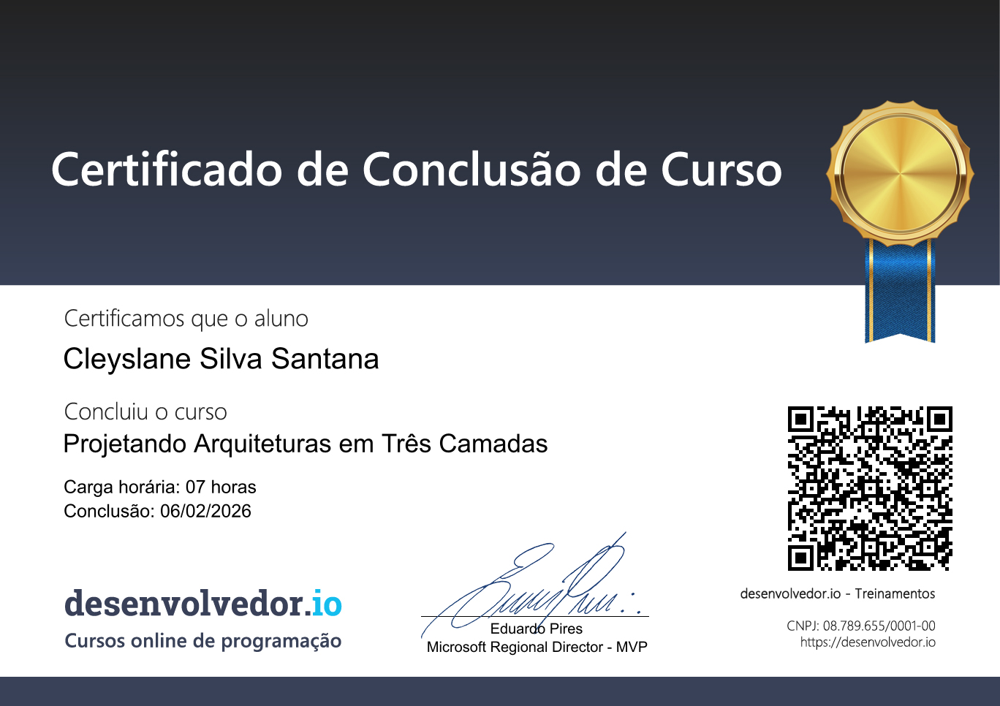

# 📐 Projetando Arquiteturas em Três Camadas

Curso **"Projetando Arquiteturas em Três Camadas"**, realizado na plataforma **Desenvolvedor.io**.

O conteúdo aborda conceitos fundamentais de arquitetura de software, com foco em aplicações .NET, boas práticas de separação de responsabilidades e organização de código em camadas bem definidas.

---

## 🎓 Certificado

> 📌 *Imagem do certificado de conclusão do curso.*

---

## 🧠 Conteúdos e Aprendizados

### 🔹 Fundamentos de Arquitetura
- Conceito de arquitetura de software
- Importância de uma boa arquitetura
- Estilos e padrões arquiteturais
- Diferenças entre:
  - Monólitos
  - Arquitetura em 3 camadas
  - DDD (Domain-Driven Design)
- Boas práticas para projetos escaláveis e manuteníveis

---

### 🔹 Arquitetura em Três Camadas
Compreensão e aplicação prática das três principais camadas:

#### 🧩 Camada de Negócio (Domain)
- Criação de entidades
- Definição de regras de negócio
- Validações de domínio
- Regras customizadas
- Notificação e tratamento de erros
- Interfaces de serviços e persistência
- Separação clara entre regras de negócio e infraestrutura

---

#### 🗄️ Camada de Acesso a Dados (Data)
- Uso do **Entity Framework**
- Criação e configuração do `DbContext`
- Mapeamento de entidades
- Customização de comportamentos do EF
- Criação de banco de dados via **Migrations**
- Implementação de:
  - Repositório genérico
  - Repositórios específicos por entidade

---

#### 🌐 Camada de Aplicação (Application / API)
- Criação da camada de aplicação
- Uso de ViewModels
- Mapeamento entre entidades e ViewModels
- Implementação de Controllers
- Mapeadores (ex: AutoMapper ou manuais)
- Resolução de dependências (Dependency Injection)
- Comunicação entre camadas
- Funcionamento da arquitetura em:
  - APIs

---

## 🛠️ Conceitos Técnicos Trabalhados
- Separação de responsabilidades (SRP)
- Dependency Injection
- Inversão de dependência
- Organização de projetos
- Clean Code aplicado à arquitetura
- Manutenibilidade e testabilidade
- Padrão Repository
- Validações centralizadas
- Tratamento de erros e notificações

---

## 🚀 Objetivo do Repositório
Este repositório serve como:
- Registro de aprendizado
- Material de consulta futura
- Demonstração de conhecimento em arquitetura de software
- Referência para projetos .NET utilizando arquitetura em camadas

---

## 📚 Plataforma
Curso realizado na plataforma **[Desenvolvedor.io](https://desenvolvedor.io)**.

---